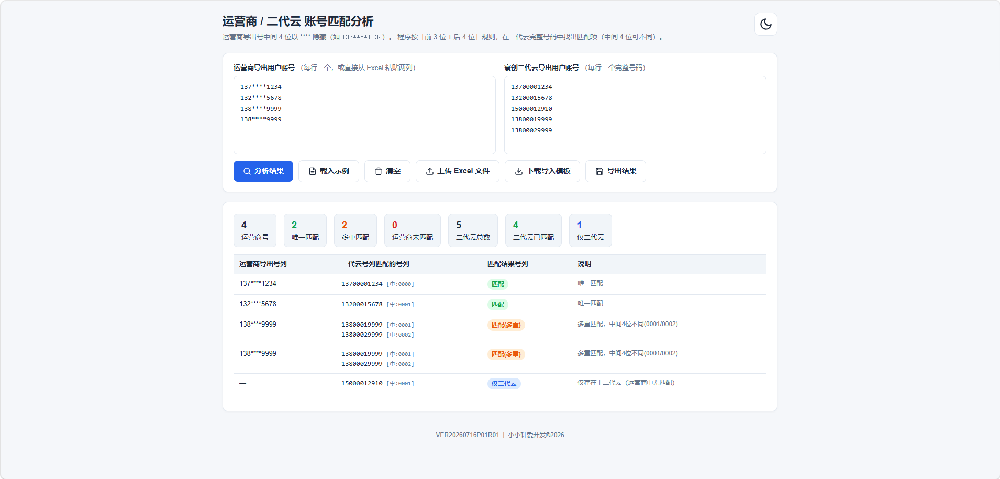
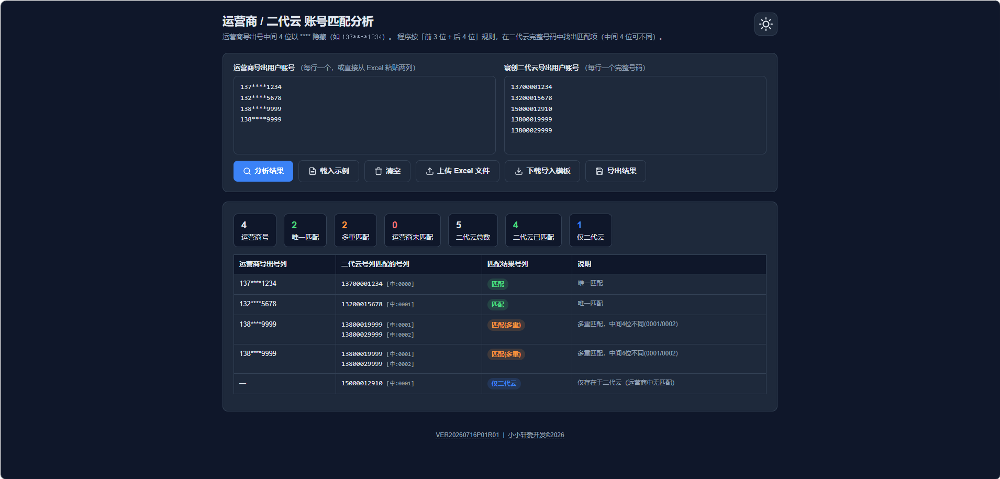

# 运营商&二代云 账号匹配分析工具（RUSP真实用户筛选平台）

用于批量比对「运营商导出用户账号」与「寰创二代云导出用户账号」的网页工具，自动按号码特征找出两者的匹配关系，并将结果以表格与统计卡片的形式呈现，支持 Excel 导入 / 导出、模板下载、明暗主题切换与结果分页。

## 功能介绍

- **智能账号匹配**：运营商导出号中间 4 位以 `****` 隐藏（如 `137****1786`），程序按「前 3 位 + 后 4 位」规则，在二代云完整号码中找出匹配项（中间 4 位允许不同）。
- **多来源输入**：
  - 两个文本框分别粘贴「运营商导出用户账号」与「二代云导出用户账号」（每行一个，或从 Excel 直接粘贴两列）。
  - 支持从 Excel（`.xlsx` / `.xls`）文件一键上传，自动读取前两列并填入对应文本框。
  - 一键「载入示例」快速体验，或「清空」重置全部输入与结果。
- **结果可视化**：
  - 统计卡片：运营商号数、唯一匹配、多重匹配、运营商未匹配、二代云总数、二代云已匹配、仅二代云数量。
  - 明细表格：运营商导出号、二代云匹配号（含中间 4 位标注 `[中:xxxx]`）、匹配结果标签（匹配 / 匹配(多重) / 未匹配 / 仅二代云）、说明。
  - 多重匹配区分：当同一特征对应多个二代云号码且中间 4 位不同时，会明确标注「多重匹配，中间4位不同」。
- **导入模板下载**：一键下载根目录下的 `模板文件.xlsx`，规范输入格式（无需联网生成）。
- **结果导出**：将匹配结果导出为 `匹配结果.xlsx`（依赖 SheetJS，离线时自动降级为 CSV 导出）。
- **分页展示**：数据量较大时自动分页，每页 50 条，支持上一页 / 下一页与页码跳转。
- **粘贴自动分列**：在运营商文本框粘贴含 Tab 的内容时，自动按 Tab 拆分为两列（运营商 / 二代云）。
- **明暗主题**：提供亮色 / 暗色两套完整界面，可随时切换（偏好记忆于本地）。

## 匹配规则

- 运营商导出号格式示例：`137****1786`（中间 4 位被 `****` 隐藏）。
- 提取规则：取 `*` 之前的前 3 位作为前缀，取最后一个 `*` 之后的后 4 位作为后缀，形成匹配键 `前缀|后缀`。
- 二代云完整号格式示例：`13700001786`，提取前 3 位 + 后 4 位作为匹配键。
- 当运营商的匹配键在二代云中存在对应项时即为「匹配」；存在多项则视中间 4 位是否一致标记为「唯一匹配 / 多重匹配」；无对应项则标记「未匹配」；仅存在于二代云、运营商中无匹配的号码标记「仅二代云」。

## 运行环境

- 运行方式：纯前端网页工具，无需安装，使用现代浏览器（Chrome / Edge / Firefox 等）打开 `index.html` 即可。
- 依赖文件（需与本说明同目录）：
  - `index.html` —— 主程序页面
  - `xlsx.full.min.js` —— SheetJS 组件，用于 Excel 上传解析与结果导出
  - `模板文件.xlsx` —— 导入模板

## 使用方法

推荐通过**本地 HTTP 服务**访问（见下方「注意事项」），直接双击 `index.html` 也可使用基础功能。

### 操作流程

1. 打开 `index.html`（建议用本地服务器，见注意事项）。
2. 在左侧粘贴「运营商导出用户账号」，右侧粘贴「寰创二代云导出用户账号」（每行一个）；或点击「上传 Excel 文件」直接导入，或点击「载入示例」体验。
3. 如从 Excel 复制两列数据，粘贴到左侧文本框时会自动按 Tab 拆分为两列。
4. 点击「分析结果」，稍候即可在下方看到统计卡片与明细表格。
5. 数据较多时，使用底部分页按钮翻页查看（每页 50 条）。
6. 需要离线留档时，点击「导出结果」生成 `匹配结果.xlsx`（无 SheetJS 时导出 CSV）。
7. 需要规范输入时，点击「下载导入模板」获取 `模板文件.xlsx`。

### 输入格式说明

| 来源 | 格式 | 说明 |
|------|------|------|
| 运营商导出用户账号 | `137****1786`（每行一个） | 中间 4 位以 `****` 隐藏；也可直接粘贴完整号码 |
| 二代云导出用户账号 | `13700001786`（每行一个） | 完整 11 位号码 |
| Excel 上传 | 前两列分别对应上述两项 | 程序自动读取并填入两个文本框 |

### 结果说明

| 匹配结果标签 | 含义 |
|--------------|------|
| 匹配 | 二代云中存在唯一对应号码 |
| 匹配(多重) | 二代云中存在多个对应号码（中间 4 位相同 / 不同会在说明中标注） |
| 未匹配 | 二代云中无对应号码（或格式无法识别） |
| 仅二代云 | 该号码仅存在于二代云，运营商中无匹配 |

## 版本与更新

- 更新日志与下载：<https://github.com/xuan-dev-studio/RUSP/releases>
- 项目主页：<https://xuan-dev-studio.github.io/>

## 运行截图

